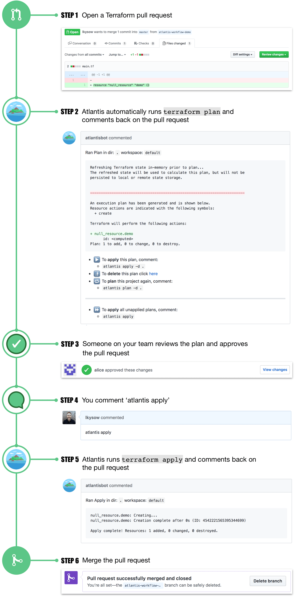

## Atlantis

- [Guia de Instalação](https://www.runatlantis.io/docs/installation-guide.html)

### Fluxo de trabalho com Atlantis

### Configuração Servidor
    - docker-compose.yml
    - Dockerfile
    - atlantis.env.example
    - repos.yaml
### Configuração repositório do Bitbucket
    - atlantis.yaml.example

### Configuração Bitbucket
 - [Webhooks](https://www.runatlantis.io/docs/configuring-webhooks.html#bitbucket-cloud-bitbucket-org)

### Setup exemplo
```BASH
docker-compose up
``` 

### hands-on
    - plan
    - apply

### Segurança
    - https://www.runatlantis.io/docs/security.html#exploits
    - https://cloud.hacktricks.xyz/pentesting-ci-cd/atlantis-security
